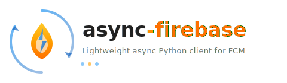

<p align="center">
  
</p>

<p align="center">
  <em>Lightweight asynchronous Python client for Firebase Cloud Messaging (FCM)</em>
</p>

[](https://pypi.python.org/pypi/async-firebase/)
[](https://pypi.python.org/pypi/async-firebase/)
[](https://pypi.python.org/pypi/async-firebase/)
[](https://pypi.python.org/pypi/async-firebase/)
[](https://github.com/healthjoy/async-firebase/actions/workflows/ci.yml)
[](https://app.codacy.com/gh/healthjoy/async-firebase/dashboard)

  * Free software: MIT license
  * Requires: Python 3.10+

## Features

  * Extremely lightweight and does not rely on ``firebase-admin`` which is hefty
  * Send push notifications to Android, iOS, and Web devices
  * Multicast push notifications (up to 500 tokens per call)
  * Send to topics and topic conditions
  * TTL, priority, and collapse-key support
  * Dry-run mode for testing
  * Topic management (subscribe/unsubscribe devices)
  * Async context manager for proper resource cleanup

## Installation

```shell
pip install async-firebase
```

## Quick Start

```python
import asyncio

from async_firebase import AsyncFirebaseClient, Message, AndroidConfig


async def main():
    async with AsyncFirebaseClient() as client:
        client.creds_from_service_account_file("secret-store/mobile-app-79225efac4bb.json")

        # or using a dictionary
        # client.creds_from_service_account_info({...})

        android_config = AndroidConfig.build(
            priority="high",
            ttl=2419200,
            collapse_key="push",
            title="Store Changes",
            body="Recent store changes",
            data={"discount": "15%", "key_1": "value_1"},
        )
        message = Message(android=android_config, token="device-token-here")
        response = await client.send(message)

        print(response.success, response.message_id)


if __name__ == "__main__":
    asyncio.run(main())
```

``send()`` returns an ``FCMResponse`` with ``success`` (bool), ``message_id`` (str), and ``exception`` (on failure) attributes.

## Platform Configs

Build platform-specific configs using the ``.build()`` classmethod:

### Android

```python
from async_firebase import AndroidConfig

android_config = AndroidConfig.build(
    priority="high",
    ttl=2419200,
    collapse_key="push",
    data={"discount": "15%", "key_1": "value_1"},
    title="Store Changes",
    body="Recent store changes",
)
```

New in v6.0: ``image``, ``ticker``, ``sticky``, ``event_timestamp``, ``local_only``, ``notification_priority``, ``vibrate_timings_millis``, ``default_vibrate_timings``, ``default_sound``, ``light_settings``, ``default_light_settings``, ``fcm_options``, ``direct_boot_ok``, ``bandwidth_constrained_ok``, ``restricted_satellite_ok``.

### iOS (APNs)

```python
from async_firebase import APNSConfig

apns_config = APNSConfig.build(
    priority="normal",
    ttl=2419200,
    apns_topic="store-updated",
    collapse_key="push",
    title="Store Changes",
    alert="Recent store changes",
    badge=1,
    category="test-category",
    custom_data={"discount": "15%", "key_1": "value_1"},
)
```

New in v6.0: ``subtitle``, ``sound`` as ``CriticalSound``, ``fcm_options``, ``live_activity_token``.

### Web Push

```python
from async_firebase import WebpushConfig

webpush_config = WebpushConfig.build(
    data={"discount": "15%"},
    title="Store Changes",
    body="Recent store changes",
    link="https://example.com/store",
)
```

> **Note:** ``client.build_android_config()``, ``client.build_apns_config()``, and ``client.build_webpush_config()``
> are deprecated. Use the ``.build()`` classmethods directly.

## Multicast

Send notifications to up to 500 devices at once:

```python
from async_firebase import AsyncFirebaseClient, MulticastMessage, AndroidConfig

async with AsyncFirebaseClient() as client:
    client.creds_from_service_account_info({...})

    android_config = AndroidConfig.build(priority="high", title="News", body="Breaking news!")

    multicast = MulticastMessage(
        android=android_config,
        tokens=["token_1", "token_2", "token_3"],
    )
    batch_response = await client.send_each_for_multicast(multicast)

    for resp in batch_response.responses:
        print(resp.success, resp.message_id)
```

``send_each_for_multicast()`` returns an ``FCMBatchResponse`` containing individual ``FCMResponse`` objects for each token.

## Topics

### Sending to a topic

```python
from async_firebase import AsyncFirebaseClient, Message, AndroidConfig

async with AsyncFirebaseClient() as client:
    client.creds_from_service_account_info({...})

    message = Message(
        android=AndroidConfig.build(priority="high", title="News", body="Update!"),
        topic="breaking-news",
    )
    response = await client.send(message)
```

A ``Message`` accepts exactly one of: ``token``, ``topic``, or ``condition``.

### Managing topic subscriptions

```python
from async_firebase import AsyncFirebaseClient

async with AsyncFirebaseClient() as client:
    client.creds_from_service_account_info({...})

    # Subscribe
    response = await client.subscribe_devices_to_topic(
        device_tokens=["token_1", "token_2"],
        topic_name="breaking-news",
    )

    # Unsubscribe
    response = await client.unsubscribe_devices_from_topic(
        device_tokens=["token_1", "token_2"],
        topic_name="breaking-news",
    )
```

## Advanced Usage

### Dry-run mode

Validate messages without actually sending them:

```python
response = await client.send(message, dry_run=True)
```

Dry-run is available on ``send()``, ``send_each()``, and ``send_each_for_multicast()``.

### Direct dataclass construction

For full control, construct message dataclasses directly instead of using ``.build()``:

```python
from datetime import datetime, timezone
from async_firebase.messages import APNSConfig, APNSPayload, ApsAlert, Aps, Message

apns_config = APNSConfig(
    headers={
        "apns-expiration": str(int(datetime.now(timezone.utc).timestamp()) + 7200),
        "apns-priority": "10",
        "apns-topic": "test-topic",
        "apns-collapse-id": "something",
    },
    payload=APNSPayload(
        aps=Aps(
            alert=ApsAlert(title="some-title", body="alert-message"),
            badge=0,
            sound="default",
            content_available=True,
            category="some-category",
            mutable_content=False,
            custom_data={
                "link": "https://link-to-somewhere.com",
                "ticket_id": "YXZ-655512",
            },
        )
    ),
)

message = Message(apns=apns_config, token="device-token-here")
response = await client.send(message)
```

### Error handling

Send failures raise specific exceptions from ``async_firebase.errors``:

```python
from async_firebase.errors import (
    AsyncFirebaseError,
    UnregisteredError,
    QuotaExceededError,
    InvalidArgumentError,
)

try:
    response = await client.send(message)
except UnregisteredError:
    # Device token is no longer valid — remove it
    ...
except QuotaExceededError:
    # FCM rate limit hit — back off and retry
    ...
except AsyncFirebaseError as e:
    print(e.code, e.message)
```

Failed responses also populate ``FCMResponse.exception`` without raising, depending on the send method.

## Changelog

See [CHANGES.md](https://github.com/healthjoy/async-firebase/blob/master/CHANGES.md) for the full release history.

## License

``async-firebase`` is offered under the MIT license.
